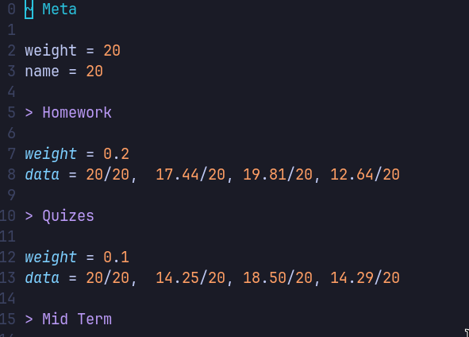

# GPA Calculator

This is a simple grade calculator written in go.
It gathers the data from local files written in
a special but simple format.

## Calculation of Grades & GPA

-   GPA ranges from 0.0 to 4.0
-   A is the highest grades at 94%
-   Read `./grade-conversions.go` for full details

There is no config to change the calculation currently, so I would recommend
modifying the source code yourself.

## Structure of Folder

I recommend having a folder with all your grades, with the structure as such:

```
grades/
├── 2022
│   ├── fall
│   │   ├── cs100.grade
│   │   ├── gov100.grade
│   │   ├── lang100.grade
│   │   └── ma100.grade
│   └── spring
│       ├── cs200.grade
│       ├── gov200.grade
│       ├── lang200.grade
│       └── ma200.grade
└── 2023
    ├── fall
    │   ├── cs300.grade
    │   ├── gov300.grade
    │   ├── lang300.grade
    │   └── ma300.grade
    └── spring
        ├── cs400.grade
        ├── gov400.grade
        ├── lang400.grade
        └── ma400.grade
```

The files, which contain the data for each class, all have the extension "grade", but it doesn't matter what extension you use.

### Grade File

The grade file is just a simple text file with specific syntax.
Grade categories and denoted with a ">" prefix and then their name,
and the children elements are the `weight` and `data`

```
> Homework
weight = 0.2
data = 20/20, 17/20, 19/20

> Midterm
weight = 0.4
data = 40/50

> Final Exam
weight = 0.4
data = 58/60
```

Comments can only be declared with a line that starts with a pound symbol (#).
Indentation and white space do not matter.

If you wish to specify options for the entire grade file, use the line "~ Meta"
at the start of your file. For example, each class is assumed to be 4 credits,
if you wish to change this use the credits option (there are 3 other recognized
options, but you can add whatever you like).

```
~ Meta
# amount of credits as an int
credits = 3

# nice name for when printing
name = "MA160 Multivariable Calculus & Series"

# your desired grade as a float from 0-100
desired_grade = 94

# describe your actual grade with a letter. this is useful if you recieve an A+,
# because the program doesn't assign A+ automatically (in my school and many, the
# professor has to assign an A+)

grade = "A+"

# unrecognized option but is ok
location = Grand Hall 202

# homework given every thursday
> Homework
# ...snip...
```

## Output

This is the structure of the output with no verbosity:

```shell
$ gpa-calculator ~/grades-1
/home/seven/grades-1 (3.08)
├── 2022 (3.12)
│   ├── fall (3.08)
│   │   ├── cs100.grade (85.16) (B)
│   │   ├── "GOV100: Introduction to Race & Politics"(87.15) (B+)
│   │   ├── lang100.grade (92.59) (A-)
│   │   └── math100.grade (78.31) (C+)
│   └── spring (3.17)
│       ├── gov200.grade (84.80) (B)
│       ├── lang200.grade (81.19) (B-)
│       ├── ma200.grade (86.79) (B)
│       └── cs200.grade (96.01) (A)
└── 2023 (3.06)
    ├── fall (2.91)
    │   ├── cs300.grade (86.40) (B)
    │   ├── gov300.grade (79.33) (C+)
    │   ├── lang300.grade (85.12) (B)
    │   └── ma300.grade (85.11) (B)
    └── spring (3.35)
        ├── cs400.grade (92.93) (A-)
        ├── gov400.grade (86.98) (B)
        ├── lang400.grade (94.66) (A)
        └── ma400.grade (81.66) (B-)
```

This is the structure with verbosity:

```shell
$ gpa-calculator ~/grades-1 - v
/home/seven/grades-1 (3.08)
├── 2022 (3.12)
│   ├── fall (3.08)
│   │   ├── cs100.grade (85.16) (B)
│   │   │    ├── Homework (90.25) (A-)
│   │   │    ├── Quizes (85.66) (B)
│   │   │    ├── Mid Term (88.00) (B+)
│   │   │    ├── Final Eaxm (80.36) (B-)
│   │   │    └── to get a 80.00% you need at least a 72.26% on the final
# ...snip...
```

## Installation

Install with brew:

```shell
brew tap kitesi/gpa-calculator https://github.com/kitesi/gpa-calculator
brew install gpa-calculator
```

Install with Go:

```shell
go install github.com/kitesi/gpa-calculator@latest
```

Otherwise, go to the releases page and install from there.

## Usage

```shell
$ gpa-calculator <folder> [-h|--help] [-v|--verbose] [--version]
```

If verbose is on it will display the subsections for a class as well, like the homework, quizzes, etc.
It will also show "target"
I personally have `gpa` aliased to `gpa-calculator $my_folder`

### Syntax Highlighting

Syntax highlighting on vim with tokyonight-night theme:



If you would like (light) syntax highlighting for the grade files and you use
vim, you can copy `./grade.vim` into `$VIMRUNTIME/syntax/grade.vim`. Then
associate the file extension with the filetype by adding this to your vim
config:

```vim
autocmd BufNewFile,BufRead *.grade setf grade
```

Syntax highlighting for vscode might be implemented in the future.

## Future

-   add root project config file like ~/grades/config.json
-   add tests
-   add syntax highlighting to grade file on vscode
-   make easier install
-   colored output

```

```
